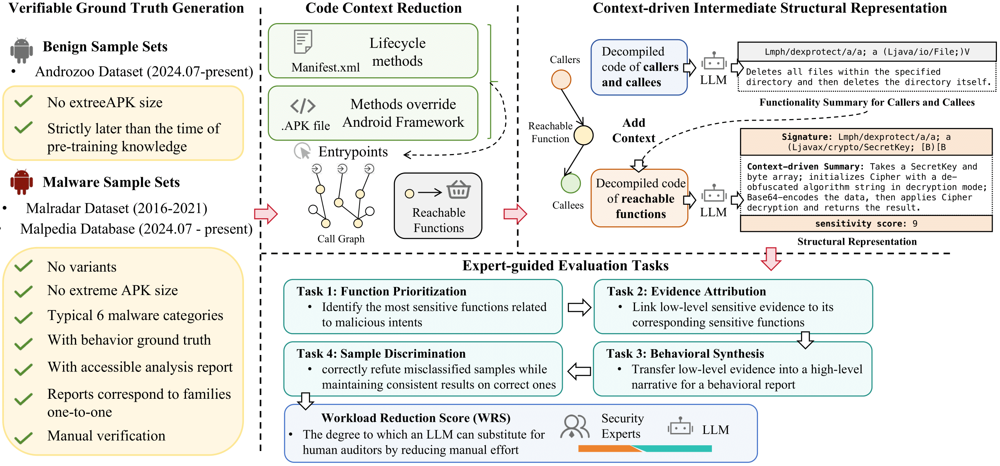

## MalEval 
This repository contains the source code of MalEval, an evaluation framework for Android malware behavior auditing, focusing on explaining and substantiating malicious behaviors. The framework provides expert-verified reports, curated metadata, and model outputs to enable reproducible evaluation of Large Language Models (LLMs) in malware auditing tasks. This evaluation framework defines four analyst-aligned evaluation tasks—function prioritization, evidence attribution, behavior synthesis, and sample discrimination—with domain-specific metrics and a unified workload-oriented score. MalEval contains 255 malware samples with corresponding raw and parsed behavior reports. Dataset can be downloaded from: [MalEval](https://huggingface.co/datasets/Xinzxr/MalEval).

It contains:
+ Behavior reports for each malicious sample
+ Metadata describing sample attributes
+ Evaluation results generated by different models
+ Raw APKs
+ The info/ folder in this repository stores the original report links corresponding to each sample

```
MalEval/
├── src/ # source code for context preparation and evaluation
├── figs/ # figures of MalEval
├── info/ # mapping from samples to original report links; sensitive API list
├── requirements.txt # pip dependencies
└── README.md # project description

